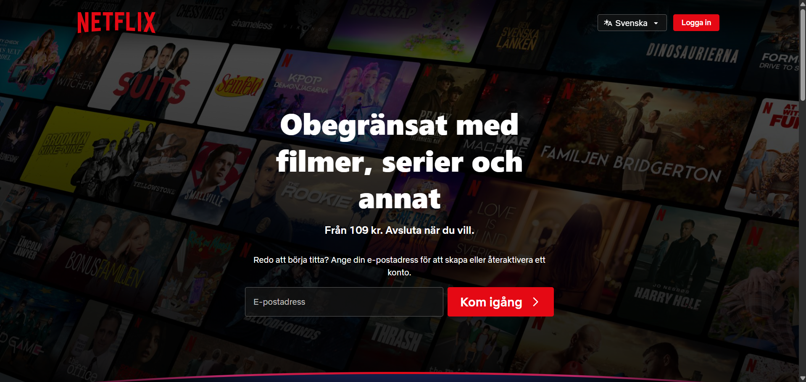
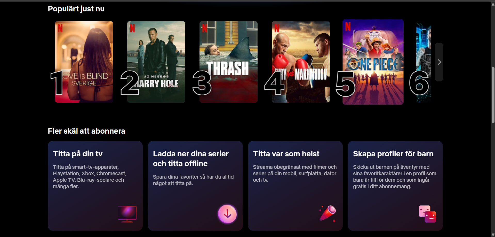
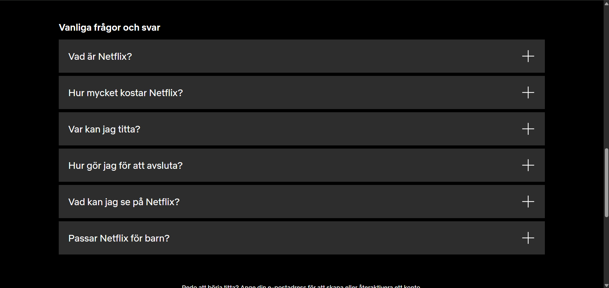
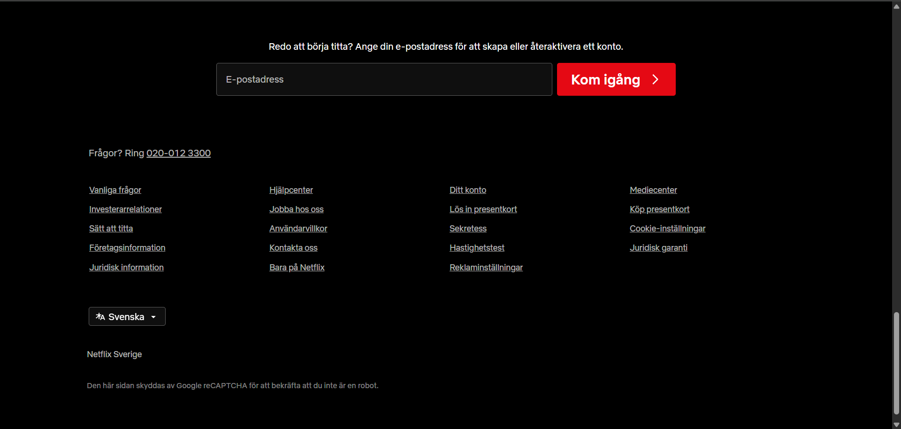

# Netflix Sverige – Websiteclone

**Skapad av:** Evan & Isak

## Om projektet

Vi har valt att återskapa startsidan för **Netflix Sverige** – den landningssida som visas för icke-inloggade besökare.

**Länk till originalsidan:** https://www.netflix.com/se/

## Vad som ingår

- Header med logotyp, språkväljare och inloggningsknapp
- Hero-sektion med bakgrundsbild, rubrik och e-postformulär
- "Populärt just nu"-sektion med filmkort och ranknummer
- "Fler skäl att abonnera"-sektion med informationskort
- FAQ-sektion med frågor och svar
- CTA-sektion (uppmaning att registrera sig) med e-postformulär
- Footer med kontaktinformation, länkkolumner och språkväljare

## Avgränsningar

- **FAQ-korten är inte klickbara** – på originalet expanderar svaren med animation. Vi har valt att inte implementera pga svårighetesgraden.
- **Bågen under Hero Section** vi kunde inte få ihop hur man lägger in den där bågen precis under herosection.
- **Filmkorten** blir större närman lägger musen på dem i orginalet och man kan blädra igenom listan horisontellt, vilket vi tyckte var för svårt att implementera.

## Skärmdumpar på originalet

